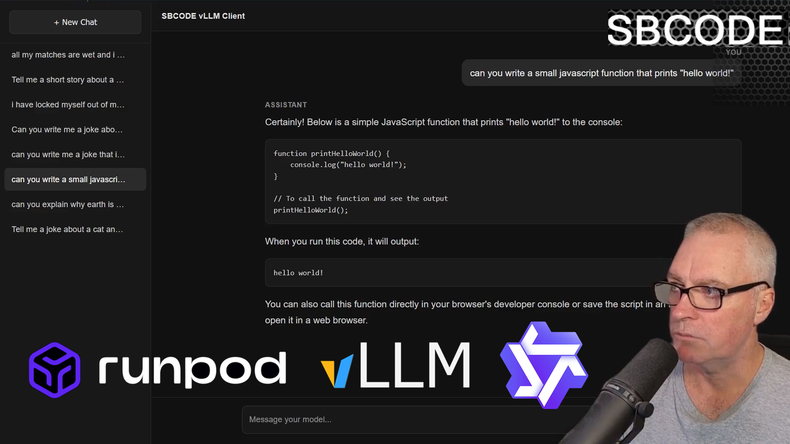

# vLLM-Client

## How to Use

Via the website directly : [https://vllm-client.sbcode.net](https://vllm-client.sbcode.net)

or,

Git clone and run locally,

1. Navigate to a folder on your computer where you'd like to download the SBCODE vLLM client.

2. Open a command/terminal prompt and execute,

   ```bash
   git clone https://github.com/Sean-Bradley/vLLM-Client.git
   ```

3. Then go in to the new folder.

   ```bash
   cd vLLM-Client
   ```

d. Open the `index.html` directly into your browser.

## Video Tutorial

[](https://youtu.be/NtcheEus-Fc)
[https://youtu.be/NtcheEus-Fc](https://youtu.be/NtcheEus-Fc)

## Configure Settings

1. Register at [Runpod](https://get.runpod.io/q0btky2wuu29) _(New users earn a small bonus credit ($5 typical, up to $500 possible) after depositing $10.)_

2. Go to **Serverless** tab and choose **vLLM** by **runpod-workers**.

3. Press **Deploy v#.##.#**

4. Enter a huggingface model.

   Some examples
   - Qwen/Qwen2.5-3B-Instruct
   - Qwen/Qwen2.5-7B-Instruct
   - Qwen/Qwen2.5-Coder-32B-Instruct
   - Qwen/Qwen3.8-27B
   - OBLITERATUS/Qwen3.8-27B-OBLITERATED
   - openai/gpt-oss-20b

5. Use **Endpoint** deployment type, accept the default **GPU Configuration** and press **Create Endpoint** (Usage is billed per millisecond, but only when workers are in `running` state)

6. After it is created, we want to get the vLLM Endpoint URL, but we will use the **OpenAI-compatible** `/v1/chat/completions` endpoint instead.
   1. Open up the **Requests** tab for your serverless vLLM endpoint and copy the `run` url.

      E.g.,
      `https://api.runpod.ai/v2/abcdefg123456/run`

   2. remove the `run` and replace with `/openai/v1/chat/completions`

      E.g.,
      `https://api.runpod.ai/v2/abcdefg123456/openai/v1/chat/completions`

   3. Paste the new URL into the SBCODE vLLM Client `Settings/vLLM Endpoint` text field

7. Go to the **Overview** tab and generate a new API key.

   E.g.,
   `rpa_ABCDEFGHIJKLMNOPQRSTUVWXYZ12345678901234567890`

   Paste your API key into the SBCODE vLLM Client `Settings/Bearer API Key` text field.

8. Example Settings

   

   > Note: These settings that you enter will be saved into your browsers own local storage for the next time you open this webpage. These settings will not be saved on the https://vllm-client.sbcode.net servers. See the privacy statement when you first open the SBCODE vLLM Client webpage.

9. Now you can start chatting.

   An example prompt can be, `write a short story about a robot`.

   Expect to wait ~5 minutes for a response, depending on the size of the AI model you selected.

   > Note: The first time you chat with your Runpod vLLM endpoint, it will auto detect the model you've chosen at Runpod, and save your settings as a button in the SBCODE vLLM Client `Settings/Saved Configurations` section.

## Improving Runpod Serverless response times.

When we setup this serverless endpoint, the default worker timeout (before it goes back to idle) is 5 seconds. If we don't write our next prompt within that 5 second countdown, our worker will go back into `idle` state and it will take ~5 minutes to wake it up again while it reloads the model into the GPU.

We can speed this process up several ways.

### Option 1

We could increase the `Idle timeout` option to maybe 300 seconds. This is 5 minutes. So, writing another prompt with that 5 minute window means that your worker will answer your chat request almost instantly.

Note that while your worker(s) is in the `running` state, you are paying for it.

This option is a good compromise when you are only planning to use your serverless endpoint for a few times in a row, maybe several occasions a day. When the endpoint goes back into its `idle` state, it won't cost you any money.

### Option 2

This is option is more expensive, since you will keep your worker(s) in the running state permanently.

Set Active Workers from `0` to `1`. If you find your endpoint is under heavier load, then you can increase the `Active Workers` value even higher. Be aware that this will cost even more since you are now permanently using even more GPU resources to store your model.

You also have the option to increase the `Max workers` and `GPU count`, but expect the costs to be higher when all workers and GPUs are being utilized.

## SBCODE vLLM Client in Relation to Runpod Infrastructure


