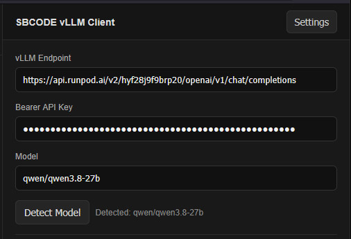
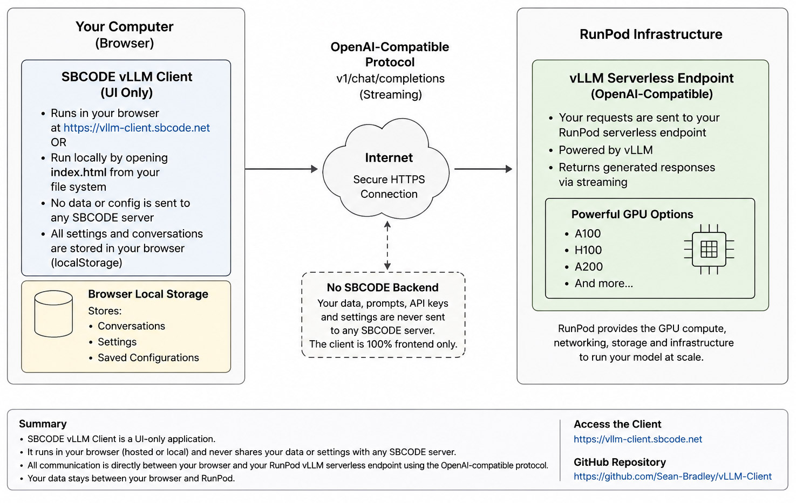

# vLLM-Client

Website : [vllm-client.sbcode.net](https://vllm-client.sbcode.net)

## Configure Settings

1. Register at [Runpod](https://get.runpod.io/q0btky2wuu29) (New users earn a small bonus credit ($5 typical, up to $500 possible) after spending $10.)

2. Go to **Serverless** tab and choose **vLLM** by **runpod-workers**.

3. Press **Deploy v#.##.#**

4. Enter a huggingface model.

   Some examples
   - Qwen/Qwen2.5-3B-Instruct
   - Qwen/Qwen2.5-7B-Instruct
   - Qwen/Qwen2.5-Coder-32B-Instruct
   - Qwen/Qwen3.8-27B
   - OBLITERATUS/Qwen3.8-27B-OBLITERATED
   - zai-org/GLM-5.3
   - XHToken/Spark-X2.5-4B
   - openai-community/gpt2

5. Use **Endpoint** deployment type, accept the default **GPU Configuration** and press **Create Endpoint** (Usage is billed per millisecond, but only when workers are in `running` state)

6. After it is created, we want to get the vLLM Endpoint URL, but we will use the **OpenAI-compatible** `/v1/chat/completions` endpoint instead.
   1. Open up the **Requests** tab for your serverless vLLM endpoint and copy the `run` url.

      E.g.,
      `https://api.runpod.ai/v2/abcdefg123456/run`

   2. remove the `run` and replace with `/openai/v1/chat/completions`

      E.g.,
      `https://api.runpod.ai/v2/abcdefg123456/openai/v1/chat/completions`

   3. Paste the new URL into the SBCODE vLLM Client `Settings/vLLM Endpoint` text field

7. Go to the **Overview** tab and generate a new API key.

   E.g.,
   `rpa_ABCDEFGHIJKLMNOPQRSTUVWXYZ12345678901234567890`

   Paste your API key into the SBCODE vLLM Client `Settings/Bearer API Key` text field.

8. Next, the quickest thing to do is press the `Detect Model` button. This will find the model name that you used when you setup your vLLM endpoint on [Runpod](https://get.runpod.io/q0btky2wuu29).

   This can take maybe 5 minutes or so while your endpoint initializes and starts running.

   > Another way to find the model value used by the worker, is check the **Logs** tab, and in the first 10 lines, you should find some text, for example `model qwen/qwen3.8-27b`. The model name is lower case compared to what we chose when we set this up at the beginning. Use the value `qwen/qwen3.8-27b` in the SBCODE vLLM Client `Settings/Model` text field.

9. Example Settings

   

   > Note: These settings that you enter will saved into your browsers own local storage for the next time you open this webpage. These settings will not be saved on the https://vllm-client.sbcode.net servers. See the privacy statement when you first open the SBCODE vLLM Client webpage.

10. Now you can start chatting.

    An example prompt can be, `write a short story about a robot`.

    Expect to wait ~5 minutes for a response.

## Improving Runpod Serverless response times.

When we setup this serverless endpoint, the default worker timeout (before it goes back to idle) is 5 seconds. If we don't write our next prompt withing 5 seconds, our worker will go into `idle` and it will take ~5 minutes to wake it up again while it loads the model into the GPU.

### Option 1

We could increase the `Idle timeout` option to maybe 300 seconds. This is 5 minutes. So, writing another prompt with 5 minutes means that your worker will answer your chat almost instantly.

Note that while your worker is in the `running` state, you are paying for it.

This option is a good compromise when you are not going to be using your serverless endpoint all the time throughout the day, week, etc, but on sporadic occasions.

### Option 2

This is option is more expensive, since you will keep your worker in the running state permanently.

Set Active Workers from `0` to `1`. If you find your endpoint is under heaver load, then you can increase the `Active Workers` value even higher. Be aware that this will cost more since you are now permanently using a GPU to store your model.

You also have the option to increase the `Max workers` and `GPU count`, but expect the costs to be even higher when all workers and GPUs are being utilized.

## SBCODE vLLM Client in Relation to Runpod Infrastructure

